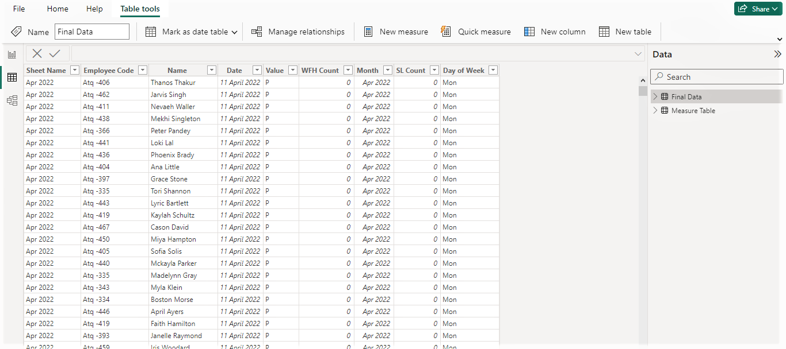

# HR Data Analytics Project Report for AtliQ Technologies

***Prepared by:*** ***Abhishek J***

---

## Project Overview

In a bid to enhance the operational efficiency of the HR team at *AltiQ Technologies,* a comprehensive HR Data Analytics project was undertaken. This project focuses on tracking and analyzing employee attendance, performance, and leave patterns over three months, ultimately resulting in the development of a Power BI dashboard that **saves an estimated 3-4 hours of daily HR work.**

The dashboard captures critical **metrics such as attendance percentage, performance, and leave patterns,** providing the HR team with actionable insights to optimize workforce management.

---

## Objectives

The key objectives of the HR Data Analytics project are as follows:

1. **Working Preference Analysis:** Understand employees' preference for *Work from Home (WFH)* versus *Work from Office (WFO).*

2. **Working Pattern Analysis:** Examine working preferences over the week to uncover specific trends.

3. **Leave Pattern Identification:** Analyze trends in leave-taking behavior, including peak leave days.

4. **Attendance Consistency:** Assess fluctuations in attendance over the three-month period.

5. **WFH and Office Presence Correlation:** Determine relationships between *WFH* and in-office attendance on specific days.

6. **Optimal Scheduling Recommendations:** Identify the best days for meetings or important events based on attendance patterns.
---

## Data Collection and Methodology

### Raw Data Overview
For this analysis, the HR team provided attendance data for **April, May, and June.** The data was processed using:

**Power Query:** *Used for cleaning and transforming raw data.*

**DAX Measures:** *Employed for data calculation and transformation.*

**Power BI:** *Visualization platform for creating interactive dashboards.*

The raw data consists of employee attendance records collected over **April, May, and June.** Each record includes:

**• Employee Code:** *A unique identifier for each employee.*

**• Date:** *Specific day of attendance.*

**• Attendance Status:** *Status for each day— “Present,” “WFH” (Work from Home), “SL” (Sick Leave), “Absent” etc.*

**• Additional Notes:** *Details on leave types (e.g., half day leave, sick leave) and other remarks.*

This data was provided in Excel format, and each month’s data was stored in a separate worksheet. The following Excel sheets were used as primary sources:

**• April_2020.xlsx**

**• May_2020.xlsx**

**• June_2020.xlsx**

**• Attendance_Key.xlsx**

***April data***

***May Data***

***June Data***

***Attendance Key***

### Data Transformation and Cleaning

The raw data was cleaned and transformed using **Power Query**, with steps that included:

**1. Data Type Conversion:** *Ensuring dates, numerical values, and text fields were correctly typed for consistency.*

**2. Removing Duplicates:** *Identifying and eliminating any duplicate records to maintain data accuracy.*

**3. Filtering Data:** *Filtering out weekends or irrelevant days (e.g., holidays) where attendance wasn’t recorded.*

**4. Calculating Weekly Percentages:** *Creating a new field to calculate weekly percentage for WFH, SL, and Presence rates.*

This cleaning process enabled a structured dataset ready for deeper analysis in Power BI.

***Data After Transformation***

### DAX Measures and Calculations

To derive insights from the cleaned data, various **DAX** (Data Analysis Expressions) measures were created in *Power BI.* Key DAX measures include:

**• Total Working Days:** *The number of total working days out of all the days in a month.*

**• WFH Percentage:** *The percentage of total work-from-home days out of total working days.*

**• Presence Percentage:** *Calculates the in-office presence percentage per day or week.*

**• Sick Leave Percentage:** *Calculates the percentage of sick leaves taken out of total working days.*

**• Average Working Hours:** *Average working hours across all employees for a given day, week, or month.*

**• Monthly Trend Calculations:** *Separate DAX measures to calculate weekly trends and month-over-month changes.*

These DAX calculations allowed the creation of **dynamic visuals** and filters within *Power BI*, facilitating an **interactive dashboard** for the HR team.

***DAX Measures***

---

## Key Insights

### Overall Insights (April - June)

The Power BI dashboard is structured to provide both a consolidated view of three months and individual monthly dashboards.
Across three months, notable trends include:

**WFH Trends:** *Highest on Fridays, with lowest WFH on Mondays, Tuesdays, and Wednesdays. Tuesday shows the lowest WFH percentage.*

**Presence Trends:** *Highest office presence on Mondays and Tuesdays.
Presence shows a gradual decline from Thursday, with Friday being the lowest.
Sick Leave Trends: Peak sick leave on Mondays, with the lowest on Fridays.*

**Sick Leave Trends:** *Peak sick leave on Mondays, with the lowest on Fridays.*

**Monthly Fluctuations:** *Attendance fluctuates heavily in May, while April and June show steady patterns. SL shows a gradual rise across the months.*

---
### Monthly Insights

### April Insights

April exhibited unique attendance and leave patterns:

**Presence Patterns:** *A significant drop in presence percentage between April 3rd and 10th.*

**High Presence Days:** *Mondays have the highest presence rate.*

**Low Presence Days:** *Thursdays witness the lowest presence.*

**WFH Trends:** *Fridays see the most WFH, while Mondays have the least.*

**Sick Leave:** *SL is notably high on Thursdays.*

**WFH Trends:** *Fridays see the most WFH, while Mondays have the least.*

**Sick Leave:** *SL is notably high on Thursdays.*

### May Insights

May saw distinct shifts in work and leave preferences:

**High WFH Days:** *WFH is especially high on Thursdays and Fridays, resulting in lower office presence on these days.*

**Sick Leave Trends:** *SL is highest on Mondays, indicating low Monday presence isn’t entirely due to WFH preference but also due to sick leaves.*

**Low Presence Days:** *Thursdays and Fridays generally have lower attendance due to high WFH.*

### June Insights

June revealed a steady increase in WFH, with specific trends on leave:

**High Presence Day:** *Tuesdays show the highest in-office presence.*

**Increasing WFH Trend:** *WFH is high on Mondays, Fridays, and Thursdays, showing a rise throughout June.*

**Sick Leave:** *SL is high on Mondays, which could imply that scheduling important events on Mondays and Fridays may not be ideal for June.*

---
## Recommendations for the HR Team
Based on the insights derived from the HR data analytics project, the following recommendations are proposed to enhance workforce management and improve overall employee satisfaction:

**1. Promote Flexible Work Arrangements**

***Recommendation:*** Given the high preference for Work from Home (WFH) on Fridays and the lower attendance on Mondays, consider implementing a flexible work policy that allows employees to choose WFH days, particularly on Mondays and Fridays.

***Action:*** Develop guidelines that encourage teams to establish their preferred working arrangements while ensuring that critical tasks are covered.

**2. Optimize Meeting Scheduling**

***Recommendation:*** Avoid scheduling important meetings or product launches on Mondays and Fridays, especially in June, when attendance is typically lower due to increased sick leave and WFH preferences.

***Action:*** Use attendance data to create a shared calendar that highlights optimal days for meetings based on presence trends, ensuring maximum participation.

**3. Implement Wellness Programs**

***Recommendation:*** The increased sick leave (SL) on Mondays indicates a need for improved employee wellness initiatives. Introducing wellness programs can help reduce absenteeism and boost morale.

***Action:*** Launch initiatives such as mental health days, fitness challenges, and health screenings, alongside resources for stress management.

**4. Encourage Team Cohesion**

***Recommendation:*** With significant WFH on Fridays, it’s essential to maintain team cohesion and communication. Encourage virtual team-building activities and collaborative projects.

***Action:*** Schedule regular check-ins or virtual team-building exercises to foster connections among remote employees, ensuring that team dynamics remain strong.

**5. Monitor and Analyze Attendance Trends Regularly**

***Recommendation:*** Continuously monitor attendance, WFH, and sick leave trends using the Power BI dashboard to identify emerging patterns and address potential issues proactively.

***Action:*** Schedule monthly reviews of the dashboard with the HR team to discuss findings and adjust HR policies as necessary based on data insights.

**6. Feedback Mechanism**

***Recommendation:*** Establish a feedback mechanism to gather employee input on the effectiveness of current HR policies, including WFH arrangements and sick leave usage.

***Action:*** Utilize anonymous surveys to collect feedback on work preferences and suggestions for improvement, allowing employees to voice their needs

**7. Evaluate and Adjust Policies**

***Recommendation:*** Regularly evaluate the effectiveness of HR policies concerning WFH, sick leave, and attendance. Be open to making adjustments based on ongoing data analysis and employee feedback.

***Action:*** Establish a quarterly review process for HR policies, using data from the Power BI dashboard to inform decisions and adaptations.

---
## Conclusion
The HR Data Analytics dashboard provides the *AltiQ Technologies* HR team with a powerful tool to **optimize attendance tracking and workforce planning.** The insights generated not only streamline HR processes but also offer data-driven recommendations for scheduling and workforce management.

By understanding patterns in WFH, office presence, and sick leave, the HR team can proactively manage resources, promote work-life balance, and ensure effective workforce planning.

---

© 2024 Abhishek J Project Portfolio.

