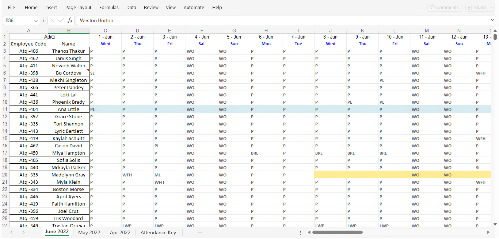

# AtliQ HR Data Analysis
---
Using the Excel sheet provided by HR Manager and trying to understand their requirements to fulfil the objectives.

## Objectives

1. Understand the working preference of people between work from home and work from office

2. Preference pattern

3. Patterns in taking leave

## Raw Data
Using the Excel **attendance sheet** of AtliQ Technologies provided by the HR Manager

### April data

### May Data

### June Data

### Attendance Key

## Prepare Data

✅ Understand the data

✅ Use of **Power Query editor**

✅ Use of unpivot

✅ Cleaning the data in Power BI

## Tools used

1. Excel
2. Power BI

## Final Data

## Measure Table

## Final Dashboard

---
## April Dashboard

---
## May Dashboard

---
## June Dashboard

---

© 2024 Abhishek J Project Portfolio.
